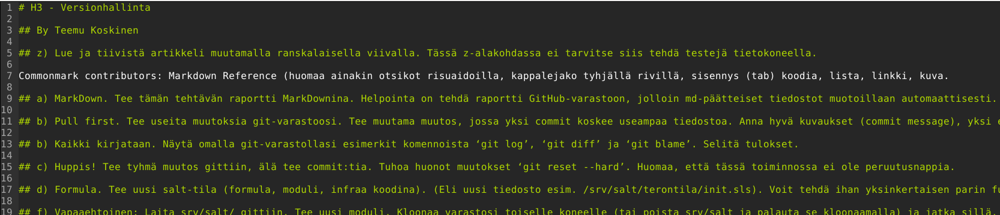

# H3 - Versionhallinta

## By Teemu Koskinen

## z) Lue ja tiivistä artikkeli muutamalla ranskalaisella viivalla. Tässä z-alakohdassa ei tarvitse siis tehdä testejä tietokoneella.

Commonmark contributors: Markdown Reference (huomaa ainakin otsikot risuaidoilla, kappalejako tyhjällä rivillä, sisennys (tab) koodia, lista, linkki, kuva. =

- Tässä sivussa esitellään miten Markdownia käytetään.
- Italialainen teksti: "italic*" ja seuraavaksi käytännössä *italialainen*. Molemmille puolille sanaa kuuluu laittaa tähti.
- Tummennettu teksti: "tummennettu**" ja käytännössä **tummennettu**. Kaksi tähteä molemmille puolille sanaa.
- Otsikot: Otsikot tehdään laittamalla lauseen eteen risuaita #. Yksi risuaita on otsikko 1 ja kaksi risuaitaa on otsikko 2 jne.
- Linkit: Linkit tehdään näin "]Link](http://jotain.com)" ja käytännössä [Youtube](https://www.youtube.com/watch?v=nivpOO5YXcA&list=PLJYWo2Sc5pH1XaZAA13VxIaC2i4JVRfXv&index=2). Laitoin tässä tahallani ekan sulun väärin päin, jotta se ei tekisi linkkiä vaan näyttäisi miten sellainen tehdään.
- Kuvat: Kuvat tehdään muuten samalla tavalla kuin linkit, mutta eteen laitetaan !. Esimerkki kuvasta:
- Blokkilainaus: Blokkilainaus tehdään näin "> Blokkilainaus" ja käytännössä:
> Blokkilainaus
- Listat: Normaalit listat voi tehdä laittamalla jomman kumman merkin -/* eteen ja painamalla välin jonka jälkeen lisätään sana. Näin tämä lista on tehty. Numero listan saa näin 1./) one, kumpikin merkki käy numeron jälkeen.
- Vaaka viiva: Vaaka viivan saa laittamalla joko kolme viivaa tai tähteä eteen. Esimerkki --- tai ***. Käytännössä:
---
- Sisäinen koodi:    

## a) MarkDown. Tee tämän tehtävän raportti MarkDownina. Helpointa on tehdä raportti GitHub-varastoon, jolloin md-päätteiset tiedostot muotoillaan automaattisesti. Tyhjä rivi tekee kappalejaon, risuaita ‘#’ tekee otsikon, sisennys merkitsee koodinpätkän.

## b) Pull first. Tee useita muutoksia git-varastoosi. Tee muutama muutos, jossa yksi commit koskee useampaa tiedostoa. Anna hyvä kuvaukset (commit message), yksi englanninkielinen lause imperatiivissa (määräysmuodossa) "Add top level menu to Foobar synchronizer"

## b) Kaikki kirjataan. Näytä omalla git-varastollasi esimerkit komennoista ‘git log’, ‘git diff’ ja ‘git blame’. Selitä tulokset.

## c) Huppis! Tee tyhmä muutos gittiin, älä tee commit:tia. Tuhoa huonot muutokset ‘git reset --hard’. Huomaa, että tässä toiminnossa ei ole peruutusnappia.

## d) Formula. Tee uusi salt-tila (formula, moduli, infraa koodina). (Eli uusi tiedosto esim. /srv/salt/terontila/init.sls). Voit tehdä ihan yksinkertaisen parin funktion (pkg, file...) tilan, tai edistyneemmin asentaa ja konfiguroida minkä vain uuden ohjelman: demonin, työpöytäohjelman tai komentokehotteesta toimivan ohjelman. Käytä tarvittaessa ‘find -printf “%T+ %p\n”|sort’ löytääksesi uudet asetustiedostot.

## f) Vapaaehtoinen: Laita srv/salt/ gittiin. Tee uusi moduli. Kloonaa varastosi toiselle koneelle (tai poista srv/salt ja palauta se kloonaamalla) ja jatka sillä.
