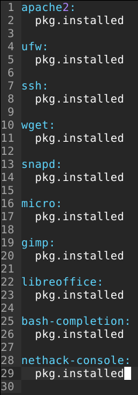
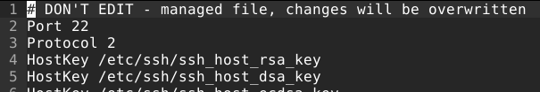
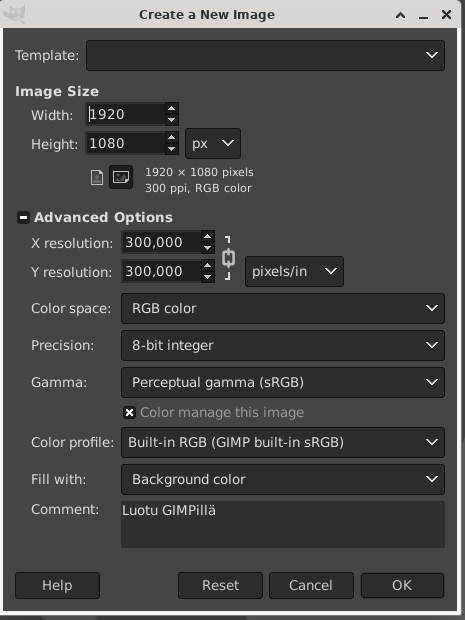

# H4 - Aikajana

## By Teemu Koskinen

## a) Captain obvious. Linuxissa on paketinhallinta, joten ohjelmien asentaminen on yksinkertaista. Tee tila, joka asentaa 10 suosikkiohjelmaasi paketinhallinnasta. Tässä a-kohdassa voit jättää ohjelmat oletusasetuksille.

Aloitetaas tämä tehtävällä sillä, että luodaan tälle tilalle oma kansio Salttiin.

	/srv/salt$ sudo mkdir top10 
	$ ls
	apache  bash  sshd  sshd_config  top10
	$ cd top10
	/top10$ 
	
Nyt kun kansio on tehty niin pitäisi alkaa miettimään, että mitä ohjelmia tällä voisi asentaa. Koneelle voisi testi mielessä asentaa ainakin apachen, SSH:n ja bash-completionin. Vielä pitäisi keksiä 7 muuta ohjelmaa. Micron voisi ainakin asentaa sillä sehän ei ole Debian distroissa valmiiksi asennettuna. UFW:n vois myös asentaa. Libreoffice ja GIMP vois olla kans hyviä ehdokkaita. Wgetin ja snapin voisi asentaa siksi, että jos joskus tarvitsee jotain jota ei löydy Debianin perus paketinhallinnasta ja nethackin pelaamista varten.

Tehdääs siis komento, joka asentaa koneelle:

- apache2
- ssh
- bash-completion
- wget
- snap
- micro
- ufw
- libreoffice
- gimp
- nethack

Tein siis tälläisen init.sls tiedoston:

Testataas nyt sitten tätä aiemmin luotua komentoa.

	$ sudo salt-call --local state.apply top10
	local:
	----------
	          ID: apache2
	    Function: pkg.installed
	      Result: True
	     Comment: All specified packages are already installed
	     Started: 18:26:19.644621
	    Duration: 101.602 ms
	     Changes:   
	----------
	          ID: ufw
	    Function: pkg.installed
	      Result: True
	     Comment: All specified packages are already installed
	     Started: 18:26:19.746468
	    Duration: 7.545 ms
	     Changes:   
	----------
	          ID: ssh
	    Function: pkg.installed
	      Result: True
	     Comment: All specified packages are already installed
	     Started: 18:26:19.754138
	    Duration: 7.253 ms
	     Changes:   
	----------
	          ID: wget
	    Function: pkg.installed
	      Result: True
	     Comment: All specified packages are already installed
	     Started: 18:26:19.761517
	    Duration: 8.113 ms
	     Changes:   

	  ID: snapd
    Function: pkg.installed
      Result: True
     Comment: The following packages were installed/updated: snapd
     Started: 18:26:19.769759
    Duration: 16325.735 ms
     Changes:   
              ----------
              snapd:
                  ----------
                  new:
                      2.49-1+deb11u1
                  old:
              squashfs-tools:
                  ----------
                  new:
                      1:4.4-2+deb11u2
                  old:
	----------
          ID: micro
    Function: pkg.installed
      Result: True
     Comment: The following packages were installed/updated: micro
     Started: 18:26:36.100886
    Duration: 4162.936 ms
     Changes:   
              ----------
              micro:
                  ----------
                  new:
                      2.0.8-1+b6
                  old:
              xclip:
                  ----------
                  new:
                      0.13-2
                  old:
	----------
          ID: gimp
    Function: pkg.installed
      Result: True
     Comment: The following packages were installed/updated: gimp
     Started: 18:26:40.269117
    Duration: 16017.033 ms
     Changes:   

	       ID: libreoffice
    Function: pkg.installed
      Result: True
     Comment: The following packages were installed/updated: libreoffice
     Started: 18:26:56.291774
    Duration: 96813.065 ms
     Changes:   

	         ID: bash-completion
    Function: pkg.installed
      Result: True
     Comment: All specified packages are already installed
     Started: 18:28:33.110388
    Duration: 753.812 ms
     Changes:   
	----------
          ID: nethack-console
    Function: pkg.installed
      Result: True
     Comment: The following packages were installed/updated: nethack-console
     Started: 18:28:33.864352
    Duration: 6110.111 ms
     Changes:   
              ----------
              nethack-common:
                  ----------
                  new:
                      3.6.6-2+b1
                  old:
              nethack-console:
                  ----------
                  new:
                      3.6.6-2+b1
                  old:

	Summary for local
	-------------
	Succeeded: 10 (changed=5)	
	Failed:     0
	-------------
	Total states run:     10
	Total run time:  140.307 s

Kaikki kymmenen komentoa onnistui ja viisi muutosta tehtiin. Jännä kyllä, että se asensi micron vaikkakin minulla on ollut se jo käytössä.

## b) CSI Pasila. Tiedostoista saa aikajanan 'cd /etc/; sudo find -printf '%T+ %p\n'|sort|tail'.

Anna esimerkki aikajanasta
Selitä jokainen kohta komennosta, jolla aikajana tehdään. Vinkki: '%T+' löytyy 'man find' kohdasta printf.
Aja jokin komento, joka muuttaa järjestelmän yhteisiä asetustiedostoja
Ota uusi aikajana ja etsi muutos sieltä
Onko samalla hetkellä muutettu yhtä vai useampaa tiedostoa?

Aloitetaas sillä, että tehdään tuo aikajana komento kuten ohjeessa näkyy ja katsotaan mitä tapahtuu.

	$ cd /etc/
	$ sudo find -printf '%T+ %p\n'|sort|tail
	2022-04-23+18:28:39.3747487650 ./nethack
	2022-04-23+18:28:39.3987487660 ./alternatives/nethack
	2022-04-23+18:28:39.4027487660 ./alternatives
	2022-04-23+18:28:39.6867487740 ./mailcap
	2022-04-23+19:57:27.0268961790 ./cups/subscriptions.conf.O
	2022-04-24+06:15:44.1619535570 ./resolv.conf
	2022-04-24+06:15:44.1659535570 .
	2022-04-24+06:15:53.7139538220 ./cups
	2022-04-24+06:15:53.7139538220 ./cups/subscriptions.conf
	2022-04-24+06:20:21.9699612440 ./apt/trusted.gpg.d/google-chrome.gpg
	
Katsotaan seuraavaksi mitä man find sivu osaa kertoa meille tästä aikajana komennosta.

- find: Tämä on pääkomento, jolla voi etsiä kaikenlaista.
- -printf: Tämä tulostaa mitä find on löytänyt näyttäen kaikki tiedostot terminaalissa.
- %T: Tämä näyttää ajan milloin tiedostot on tehty tai niitä on viimeksi muokattu.
- %p: Tämä näyttää tiedoston nimen.
- \n: Tämä luo uuden rivin.
- sort: Tämä erottelee tulokset seuraavan komennon mukaan, joka on toisen putken jälkeen.
- tail: Näyttää hännän eli viimeisimmät muutokset.

Laitoin tässä kohtaa testiksi tuon micron softwrapin pois päältä niin katsotaan seuraavaksi tuliko aikajaan muutoksia.

	$ cd /etc/
	$ sudo find -printf '%T+ %p\n'|sort|tail 
	2022-04-23+18:28:39.3747487650 ./nethack
	2022-04-23+18:28:39.3987487660 ./alternatives/nethack
	2022-04-23+18:28:39.4027487660 ./alternatives
	2022-04-23+18:28:39.6867487740 ./mailcap
	2022-04-23+19:57:27.0268961790 ./cups/subscriptions.conf.O
	2022-04-24+06:15:44.1619535570 ./resolv.conf
	2022-04-24+06:15:44.1659535570 .
	2022-04-24+06:15:53.7139538220 ./cups
	2022-04-24+06:15:53.7139538220 ./cups/subscriptions.conf
	2022-04-24+06:20:21.9699612440 ./apt/trusted.gpg.d/google-chrome.gpg
	
Näemmä micron asetusten muuttamsita ei lasketa järjestelmän asetusten muuttamiseksi. Katsotaas sitten netistä, jos löytyisi se komento, jolla promptin sai näyttämään vain viimeisimmän kansion eikä koko kansiohakemsitoa alaken käyttäjästä ja koneesta.

Netistä löytyi tälläinen sivusto:[Techglimpse.com](https://techglimpse.com/shorten-bash-prompt-linux/) ja siellä metodi neljä vaikutti tutulta: PS1="[\W]\\$ ".

Kokeillaas tota komentoa seuraavaksi.

	[~]$ cd /etc/
	[etc]$ sudo find -printf '%T+ %p\n'|sort|tail
	2022-04-23+18:28:39.3747487650 ./nethack
	2022-04-23+18:28:39.3987487660 ./alternatives/nethack
	2022-04-23+18:28:39.4027487660 ./alternatives
	2022-04-23+18:28:39.6867487740 ./mailcap
	2022-04-23+19:57:27.0268961790 ./cups/subscriptions.conf.O
	2022-04-24+06:15:44.1619535570 ./resolv.conf
	2022-04-24+06:15:44.1659535570 .
	2022-04-24+06:15:53.7139538220 ./cups
	2022-04-24+06:15:53.7139538220 ./cups/subscriptions.conf
	2022-04-24+06:20:21.9699612440 ./apt/trusted.gpg.d/google-chrome.gpg
	
Tämän pitäisi kyllä olla jo järjestelmä kohtainen asetus, jotenka on outoa, että sitä ei mukamas löydy /etc/ alta.

Kaivelin ny näitä aikajanoja ja ottamalla jopa ton tailin tuolta lopusta pois, mutta en löytänyt tota promptin muutosta mistään. Katsotaas jos jotain muuta voisi muutella joka aiheuttaisi muutoksen aikajanalle. 

Laitoin nyt sitten sudo a2dismod userdir komennon päälle ja käynnistin Apachen uudelleen niin nyt näkyy tämä muutos aikajanassa.

	2022-04-24+08:24:14.6109810970 ./cups
	2022-04-24+08:32:46.6109610430 ./apache2/mods-enabled

Vaikuttaa siltä, että /ect:n alla on muutettu vain näitä Apachen asetuksia eikä muita asetuksia ole muutettu ainakaan samaan aikaan.

## c) Tiedän mitä teit viime kesän^H^H^H komennolla. Säädä jotain ohjelmaa ja etsi sen muuttamat tiedostot aikajanasta. Tee sitten tästä oma Saltin tila.

Vinkki: tässä kohdassa pitää muuttaa jonkin ohjelman asetuksia, pelkkä ohjelman asennus pkg.installed on liian helppoa.

Laiskana ihmisenä päätin tässä tehtävässä käydä laittamassa noi SSH:n asetukset takasin kohdilleen, ku ne aiemmissa läksyissä muutettiin ja tulos tuli aikajanaan näkyviin.

	2022-04-24+08:32:46.6109610430 ./apache2/mods-enabled
	2022-04-24+09:36:04.3748122860 ./ssh/sshd_config
	
Käydääs seuraavaksi korjaamassa aiemmin tehty SSH tila.

Muutettu herran alta löytyvä sshd_config:

Testataas tätä Saltin komentoa.

	$ sudo salt-call --local state.apply sshd
	local:
	----------
	          ID: openssh-server
	    Function: pkg.installed
	      Result: True
	     Comment: All specified packages are already installed
	     Started: 09:44:59.113796
	    Duration: 92.588 ms
	     Changes:   
	----------
	          ID: /etc/ssh/sshd_config
	    Function: file.managed
	      Result: True
	     Comment: File /etc/ssh/sshd_config is in the correct state
	     Started: 09:44:59.211768
	    Duration: 41.357 ms
	     Changes:   
	----------
	          ID: sshd
	    Function: service.running
	      Result: True
	     Comment: The service sshd is already running
	     Started: 09:44:59.254478
	    Duration: 36.427 ms
	     Changes:   
	
	Summary for local
	------------
	Succeeded: 3
	Failed:    0
	------------
	Total states run:     3
	Total run time: 170.372 ms
	[Linux-HomeWork]$ ssh teemuk@localhost
	ssh: connect to host localhost port 22: Connection refused
	
Näyttää siltä, että SSH ei jostain käynnistynyt uudelleen käydääs kattomassa vielä sitä SSH tilaa.

	openssh-server:
	 pkg.installed
	
	/etc/ssh/sshd_config:
	 file.managed:
	  - source: salt://sshd_config
	
	sshd:
	 service.running:
	   - watch:
	     - file: /etc/ssh/sshd_config

Init.sls näyttää kyllä oikealta. Ehkä syynä tähän on se, että kävin aiemmin jo muuttamassa tuota alkuperäsitä tiedostoa.

Käynnistetääs siis SSH uudelleen manuaalisesti.

	 sudo systemctl restart ssh
	 ssh teemuk@localhost
	 	The authenticity of host 'localhost (::1)' can't be established.
	 	ECDSA key fingerprint is SHA256:vUZcPsDaVD2Em5hKHGMd0kRD84uUSBkRYaFzhnT/DsI.
	 	Are you sure you want to continue connecting (yes/no/[fingerprint])? yes
	 	Warning: Permanently added 'localhost' (ECDSA) to the list of known hosts.
	 	Linux teemu-yoga 5.10.0-13-amd64 #1 SMP Debian 5.10.106-1 (2022-03-17) x86_64
	 	
	 	The programs included with the Debian GNU/Linux system are free software;
	 	the exact distribution terms for each program are described in the
	 	individual files in /usr/share/doc/*/copyright.
	 	
	 	Debian GNU/Linux comes with ABSOLUTELY NO WARRANTY, to the extent
	 	permitted by applicable law.

Nyt vaikuttas toimivan SSH tosta portista 22.
	 		
## d) Asenna jokin toinen ohjelma asetuksineen.

Vinkki: tässäkin kohdassa edellytetään asetusten muuttamista. Jos haluat, voit valita erilaisen ohjelman kuin c-kohdassa. Esimerkiksi jos asensit c-kohdassa demonin, voit asentaa tässä komentoriviohjelman tai graafisen käyttöliittymän ohjelman.

Hmm, minkäs ohjelman nyt seuraavaksi sitten asentaisi ja jonka asetuksia olisi helppo muokata? Mitä jos asennettaisiin Synaptic tälle koneelle niin nähtäisiin helpommin mitä paketti vaihtoehtoja on saatavilla.

Tehdääs siis ensin Salt komento, joka asentaa Synapticin, sillä en vielä tiedä mitä Synapticin asetuksia voi ja kannattaa muokata komentorivin kautta.

	/srv/salt$ ls
	apache  bash  sshd  sshd_config synaptic  top10

	$ sudo salt-call --local state.apply synaptic
	local:
	----------
	          ID: synaptic
	    Function: pkg.installed
	      Result: True
	     Comment: All specified packages are already installed
	     Started: 14:53:35.148331
	    Duration: 68.133 ms
	     Changes:   
	
	Summary for local
	------------
	Succeeded: 1
	Failed:    0
	------------
	Total states run:     1
	Total run time:  68.133 ms

Nyt on Synaptic asennettu niin katsotaas mitä asetuksia siitä voi muokata.

Näemmä pienen etsinnän jälkeen Synapticin asetuksia ei voi muuttaa sillä confi tiedostossa jonka löysin ei ole juuri mitään. Valitaas jokin toinen ohjelma ja nyt on pakko sanoa, että en jaksa enää etsiä ohjelmia jotka voi "ehkä" suoraan asentaa APT:n paketinhallinnasta, sillä ne mitä haluaisin niin ei taida löytyä sieltä suoraan ja siksi ne eivät toimi Saltilla.

Laiskana ihmisenä taidan tehdä tämän tehtävän aiemmin asennetun Gimpin avulla, jotenka luodaas Gimbille oma Saltin tila

 	/srv/salt$ ls
	apache  bash gimp  sshd  sshd_config synaptic  top10

Init.sls: sisältö:

	gimp:
	 pkg.installed
	 
	/etc/gimp/2.0/gimprc:
	 file.managed:
	  - source: salt://gimprc
	 
	sshd:
	 service.running:
	   - watch:
	     - file: /etc/gimp/2.0/gimprc

Tässä on Saltista löytyvän gimprc:n sisältö:

	 (default-image
     (width 1920)
     (height 1080)
     (unit pixels)
     (xresolution 300)
     (yresolution 300)
     (resolution-unit inches)
     (image-type rgb)
     (precision u8-gamma)
     (color-managed yes)
     (color-profile NULL)
     (fill-type background)
     (comment "Luotu GIMPillä"))

Tämä oli ainoa mistä otin kommentoinnin pois enkä siis edes kopioinut koko confi tiedostoa sinne. Testataas muuttuuko Gimpin käyttö.

	local:
	----------
	          ID: gimp
	    Function: pkg.installed
	      Result: True
	     Comment: All specified packages are already installed
	     Started: 15:49:00.682919
	    Duration: 88.234 ms
	     Changes:   
	----------
	          ID: /etc/gimp/2.0/gimprc
	    Function: file.managed
	      Result: True
	     Comment: File /etc/gimp/2.0/gimprc updated
	     Started: 15:49:00.774963
	    Duration: 55.513 ms
	     Changes:   
	              ----------
	              diff:
	                  --- 
	                  +++ 
	                  @@ -136,7 +136,6 @@
	                   # This is a colon-separated list of folders to search.
	                   # 
	                   # (palette-path-writable "${gimp_dir}/palettes")
	                  -
	                   # Sets the gradient search path.  This is a colon-separated list of folders
	                   # to search.
	                   # 

Tiedosto vaikuttaa muuttuneen. Katsotaan seuraavaksi miltä Gimp näyttää.	

	

Kuten kuvasta näkyy niin nyt mun tekemä kommentti näkyy tuolla new image kohdassa. Tiedän, että tonne service.running kohtaan jäi toi sshd ku kopsasin init tiedoston sieltä, mutta se ei ny tässä tehtävässä haitannu yhtään.

## Lähteet:

- [Techglimpse.com](https://techglimpse.com/shorten-bash-prompt-linux/)
