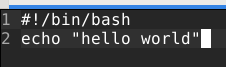

# H5 - Uusi Komento

## By Teemu Koskinen

Sanon tähän alkuun nyt näin, että Linux tehtävien eli tämän kyseisen koneen laitteisto löytyy laitteisto.md nimisestä tiedostosta jos sen haluaa tietää. [Koneen Laitteisto](https://github.com/Teemu21/Linux-HomeWork/blob/main/laitteisto.md) Toinen asia on se, että en jaksa kirjoittaa joka raporttiin sen aloitus päivää, sillä näkeehän sieltä githubin historiasta eli vanhoista commiteista. Kaikki Linux tehtävät alkavat "Start Linux homework H?" virkkeellä, jossa kysymysmerkki on korvattu tehtävän numerolla. Lopetus päivän voin tänne laittaa jos se on tarpeellista.

## a) Hei komento! Tee järjestelmään uusi "hei maailma" -komento ja asenna se orjille Saltilla. Liitä raporttiisi 'ls -l /usr/local/bin/' tulosteesta ainakin se rivi, jolla näkyy uuden komentotiedostosi oikeudet. Vinkkejä: tee shell script, joka tulostaa "hei maailma". Kokeile ensin käsin, sitten automatisoi. Luonteva paikka paketinhalllinnan ulkopuolelta asennetuille ohjelmille on /usr/local/bin/. Katso myös 'salt-call --local sys.state_doc file.managed'. Muista (aina ja kaikessa mitä teet tietokoneella) testata lopputulos. Hyvä testi on mahdollisimman lähellä sitä, mitä käyttäjä tekisi.

Aloitetaan tämä tehtävä siis sillä, että katsotaan löytyykö Teron sivulta tietoja noista shellliskripteistä, koska itse en ainakaan muista miten niitä tehtiin. Teron sivuilta löytyikin [Shell Scripting](https://terokarvinen.com/2007/shell-scripting-4/?fromSearch=shell) niminen artikkeli ja se muistutti minua siitä, että shelliskripti on vain tiedosto, jossa on kokoelma komentoja. Testaas ensin musitanko miten hello worldi tehdään. 

	$ print (hello world)
	bash: syntax error near unexpected token `hello'
	$ print ("hello world")
	bash: syntax error near unexpected token `"hello world"'
	$ print "hello world"
	Error: no such file "hello world"
	$ echo "hello world"
	hello world
	
No, muistinhan mä ny lopussa sit miten toi hello worldi tehdään eli tehdään seuraavaksi tuo itse komento tälle. 

Shelliskriptin koodi:

Testataas tätä seuraavaksi.

$ bash hello
hello world

Tällä hetkellä tämä vaatii vielä ton bashin tohon eteen. Kopioidaan tämä siis seuraavaksi tonne /usr/local/bin kansioon ja katsotaan tarvitaanko bashia enää.

	$ sudo cp hello /usr/local/bin/
	$ hello
	bash: /usr/local/bin/hello: Permission denied
	$ sudo hello
	sudo: hello: command not found

Vaikuttaa siltä, että käyttöoikeudet mun hello shelliin on jotenkin väärin katsotaas ne seuraavaksi.

	$ ls -l  /usr/local/bin/hello
	-rw-r--r-- 1 root root 31  1. 5. 11:34 /usr/local/bin/hello
	
Sitä ei näemmä voi ajaa kukaan. Korjataas asia chmod komennolla ja ajetaan komento chmod 755.

	$ sudo chmod 755  /usr/local/bin/hello
	$ ls -l  /usr/local/bin/hello
	-rwxr-xr-x 1 root root 31  1. 5. 11:34 /usr/local/bin/hello

Testataas toimiiko hello nyt ilman bashia.

	$ hello
	hello world

Nyt toimii hello komento käsipelillä. Tehdääs seuraavaksi tästä Saltin tila ja automatisoidaan se.

## b) whatsup.sh. Tee järjestelmään uusi komento, joka kertoo ajankohtaisia tietoja; asenna se orjille. Vinkkejä: Voit näyttää valintasi mukaan esimerkiksi päivämäärää, säätä, tietoja koneesta, verkon tilanteesta...

## c) hello.py. Tee järjestelmään uusi komento Pythonilla ja asenna se orjille. Vinkkejä: Hei maailma riittää, mutta propellihatut saavat toki koodaillakin. Shebang on "#!/usr/bin/python3". Helpoin Python-komento on: print("Hei Tero!")

## d) Laiskaa skriptailua. Tee kansio, josta jokainen skripti kopioituu orjille. Vinkki: 'salt-call --local sys.state_doc file.recurse'. Kun tämä on valmis, on todella helppoa laittaa orjille mikä tahansa yhden tiedoston shell script, Python-ohjelma, Perl-ohjelma, Go-binääri tai muu yhden binäärin ohjelma.

## e) Intel. Etsi kolme loppuprojektia joltain vanhalta kurssitoteutukselta. Kuvaile projektit tiiviisti ja linkitä alkuperäiseeen raporttin. Vinkkejä: Loppuprojekteja löydät etsimällä opiskelijoiden raportteja vanhoilta kursseilta ja selailemalla sivuja, joilta ne löytyivät. Raportteja löytyy vanhojen kurssitotetusten kommenteista. Ja tietysti kannattaa silmäillä listaa sieltä täältä, niin näet eri projektit kuin muut. Voi hakea myös Googlella ja DuckDuckGolla.

## e) Lukua, ei luottamusta. Kokeile yhtä kohdassa d-Intel löytämääsi modulia koneella. Tämä on infraa koodina, joten luottamusta ei tarvita. Voit lukea koodista, mitä olet ajamassa.
