# H5 - Uusi Komento

## By Teemu Koskinen

Sanon tähän alkuun nyt näin, että Linux tehtävien eli tämän kyseisen koneen laitteisto löytyy laitteisto.md nimisestä tiedostosta jos sen haluaa tietää. [Koneen Laitteisto](https://github.com/Teemu21/Linux-HomeWork/blob/main/laitteisto.md) Toinen asia on se, että en jaksa kirjoittaa joka raporttiin sen aloitus päivää, sillä näkeehän sieltä githubin historiasta eli vanhoista commiteista. Kaikki Linux tehtävät alkavat "Start Linux homework H?" virkkeellä, jossa kysymysmerkki on korvattu tehtävän numerolla. Lopetus päivän voin tänne laittaa jos se on tarpeellista.

## a) Hei komento! Tee järjestelmään uusi "hei maailma" -komento ja asenna se orjille Saltilla. Liitä raporttiisi 'ls -l /usr/local/bin/' tulosteesta ainakin se rivi, jolla näkyy uuden komentotiedostosi oikeudet. Vinkkejä: tee shell script, joka tulostaa "hei maailma". Kokeile ensin käsin, sitten automatisoi. Luonteva paikka paketinhalllinnan ulkopuolelta asennetuille ohjelmille on /usr/local/bin/. Katso myös 'salt-call --local sys.state_doc file.managed'. Muista (aina ja kaikessa mitä teet tietokoneella) testata lopputulos. Hyvä testi on mahdollisimman lähellä sitä, mitä käyttäjä tekisi.

Aloitetaan tämä tehtävä siis sillä, että katsotaan löytyykö Teron sivulta tietoja noista shellliskripteistä, koska itse en ainakaan muista miten niitä tehtiin. Teron sivuilta löytyikin [Shell Scripting](https://terokarvinen.com/2007/shell-scripting-4/?fromSearch=shell) niminen artikkeli ja se muistutti minua siitä, että shelliskripti on vain tiedosto, jossa on kokoelma komentoja. Testaas ensin musitanko miten hello worldi tehdään. 

	$ print (hello world)
	bash: syntax error near unexpected token `hello'
	$ print ("hello world")
	bash: syntax error near unexpected token `"hello world"'
	$ print "hello world"
	Error: no such file "hello world"
	$ echo "hello world"
	hello world
	
No, muistinhan mä ny lopussa sit miten toi hello worldi tehdään eli tehdään seuraavaksi tuo itse komento tälle. 

Shelliskriptin koodi:

Testataas tätä seuraavaksi.

	$ bash hello
	hello world

Tällä hetkellä tämä vaatii vielä ton bashin tohon eteen. Kopioidaan tämä siis seuraavaksi tonne /usr/local/bin kansioon ja katsotaan tarvitaanko bashia enää.

	$ sudo cp hello /usr/local/bin/
	$ hello
	bash: /usr/local/bin/hello: Permission denied
	$ sudo hello
	sudo: hello: command not found

Vaikuttaa siltä, että käyttöoikeudet mun hello shelliin on jotenkin väärin katsotaas ne seuraavaksi.

	$ ls -l  /usr/local/bin/hello
	-rw-r--r-- 1 root root 31  1. 5. 11:34 /usr/local/bin/hello
	
Sitä ei näemmä voi ajaa kukaan. Korjataas asia chmod komennolla ja ajetaan komento chmod 755.

	$ sudo chmod 755  /usr/local/bin/hello
	$ ls -l  /usr/local/bin/hello
	-rwxr-xr-x 1 root root 31  1. 5. 11:34 /usr/local/bin/hello

Testataas toimiiko hello nyt ilman bashia.

	$ hello
	hello world

Nyt toimii hello komento käsipelillä. Tehdääs seuraavaksi tästä Saltin tila ja automatisoidaan se.

	/srv/salt$ sudo mkdir hello

Loin hello ohjelmalle oman kansion Salttiin.

Tehdään seuraavaksi init.sls.

Kokeillaas tätä seuraavaksi.

	$ sudo salt "*" state.apply hello
	teemu-yoga:
	----------
	          ID: /usr/local/bin/
	    Function: file.managed
	      Result: False
	     Comment: Specified target /usr/local/bin/ is a directory
	     Started: 18:21:15.400549
	    Duration: 1.522 ms
	     Changes:   
	
	Summary for teemu-yoga
	------------
	Succeeded: 0
	Failed:    1
	------------
	Total states run:     1
	Total run time:   1.522 ms
	raspberrypi:
	----------
	          ID: /usr/local/bin/
	    Function: file.managed
	      Result: False
	     Comment: Specified target /usr/local/bin/ is a directory
	     Started: 18:20:24.676625
	    Duration: 12.554 ms
	     Changes:   
	
	Summary for raspberrypi
	------------
	Succeeded: 0
	Failed:    1
	------------
	Total states run:     1
	Total run time:  12.554 ms
	ERROR: Minions returned with non-zero exit code
	
Näyttää siltä, että tonne pitää tehä oma kansio tälle jotenka korjataas init.sls tiedostoa.

Testataan uudelleen.

	$ sudo salt "*" state.apply hello
	teemu-yoga:
	----------
	          ID: /usr/local/bin/hello
	    Function: file.managed
	      Result: True
	     Comment: File /usr/local/bin/hello is in the correct state
	     Started: 18:24:29.993623
	    Duration: 44.937 ms
	     Changes:   
	
	Summary for teemu-yoga
	------------
	Succeeded: 1
	Failed:    0
	------------
	Total states run:     1
	Total run time:  44.937 ms
	raspberrypi:
	----------
	          ID: /usr/local/bin/hello
	    Function: file.managed
	      Result: True
	     Comment: File /usr/local/bin/hello updated
	     Started: 18:23:38.260169
	    Duration: 194.842 ms
	     Changes:   
	              ----------
	              diff:
	                  New file
	              mode:
	                  0755
	
	Summary for raspberrypi
	------------
	Succeeded: 1 (changed=1)
	Failed:    0
	------------
	Total states run:     1
	Total run time: 194.842 ms

Nyt vaikuttaa onnistuneen. En poistanut tältä koneelta tota aiemmin käsin tehtyä hello komentoa, koska ajattelin testata tätä omalla Raspberrypilla, jotenka katsotaan toimiiko hello komento sillä.

Jes, näyttää hello komento toimivan ihan oikealla orjalla.
	
## b) whatsup.sh. Tee järjestelmään uusi komento, joka kertoo ajankohtaisia tietoja; asenna se orjille. Vinkkejä: Voit näyttää valintasi mukaan esimerkiksi päivämäärää, säätä, tietoja koneesta, verkon tilanteesta...

Rakennetaas seuraavaksi komento, joka kertoo päivämäärän, sään ja tietoja koneesta. En aiemmin tiennyt, että säänkin voi katsoa Linuxilla, jotenka Googletin ja löysin [Linuxconfigin](https://linuxconfig.org/get-your-weather-forecast-from-the-linux-cli) ohjeet siitä miten sään saa näkymään Linuxilla. Tehdään seuraavaksi uusi shellikripti.

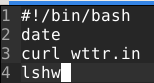

Testataan.

	$ bash important
	su 1.5.2022 19.21.50 +0300
	Weather report: Espoo, Finland

	     \  /       Partly cloudy
	   _ /"".-.     +10(8) °C      
	     \_(   ).   → 15 km/h      
	     /(___(__)  10 km          
	                0.0 mm         
                                                                                                           

	Follow @igor_chubin for wttr.in updates
	important: line 4: lshw: command not found

Shelliskripti vaikuttaa toimivan, mutta mun koneella ei näemmä ole asennettuna lshw ohjelmaa, jotenka asennetaan se ja testataan uudelleen.

	teemu-yoga                  
	    description: Computer
	    width: 64 bits
	    capabilities: smp vsyscall32
	  *-core
	       description: Motherboard
	       physical id: 0
	     *-memory
	          description: System memory
	          physical id: 0
	          size: 3968MiB
	     *-cpu
	          product: Intel(R) Core(TM) i5-7200U CPU @ 2.50GHz
	          vendor: Intel Corp.
	          physical id: 1
	          bus info: cpu@0
	          size: 3018MHz
	          capacity: 3100MHz
	          width: 64 bits
	          capabilities: fpu fpu_exception wp vme de pse tsc msr pae mce cx8 apic sep mtrr pge mca cmov pat pse36 clflush dts acpi mmx fxsr sse sse2 ss ht tm pbe syscall nx pdpe1gb rdtscp x86-64 constant_tsc art arch_perfmon pebs bts rep_good nopl xtopology nonstop_tsc cpuid aperfmperf pni pclmulqdq dtes64 monitor ds_cpl est tm2 ssse3 sdbg fma cx16 xtpr pdcm pcid sse4_1 sse4_2 x2apic movbe popcnt tsc_deadline_timer aes xsave avx f16c rdrand lahf_lm abm 3dnowprefetch cpuid_fault epb invpcid_single pti ssbd ibrs ibpb stibp fsgsbase tsc_adjust bmi1 avx2 smep bmi2 erms invpcid mpx rdseed adx smap clflushopt intel_pt xsaveopt xsavec xgetbv1 xsaves dtherm ida arat pln pts hwp hwp_notify hwp_act_window hwp_epp md_clear flush_l1d arch_capabilities cpufreq
	     *-pci
	          description: Host bridge
	          product: Xeon E3-1200 v6/7th Gen 

Nyt toimii lshw:kin. Pitää muistaa laittaa Saltti tilaan myös tuo lshw:n asennus siltä varalta, että se ei ole valmiiksi asennettuna.

Tehdääs seuraavaksi uusi Saltin tila.

	srv/salt$ sudo mkdir important
	/srv/salt$ cd hello
	/srv/salt/hello$ sudo cp init.sls /srv/salt/important/
	/srv/salt/hello$ cd ..
	/srv/salt$ cd important
	/srv/salt/important$ ls
	init.sls
	
Aloitin tämän tekemällä uuden kansion Salttiin ja sitten kopsasin ton hello kansion init.sls tiedoston tonne important kansioon nii ei tarvii lähtee ihan tyhjästä.

Seuraavaksi voisin kopsata important komennon tonne Salt kansioon.

	$ sudo cp important /srv/salt/important/ 
	$ cd /srv/salt/important/
	/srv/salt/important$ ls
	important  init.sls
	
Seuraavaksi muutetaan init.sls tiedostoa.

Testataas siis tätä komentoa.

	$ sudo salt "*" state.apply important
	teemu-yoga:
	----------
	          ID: /usr/local/bin/important
	    Function: file.managed
	      Result: True
	     Comment: File /usr/local/bin/important updated
	     Started: 19:50:05.626039
	    Duration: 50.38 ms
	     Changes:   
	              ----------
	              diff:
	                  New file
	              mode:
	                  0755
	
	Summary for teemu-yoga
	------------
	Succeeded: 1 (changed=1)
	Failed:    0
	------------
	Total states run:     1
	Total run time:  50.380 ms
	raspberrypi:
	----------
	          ID: /usr/local/bin/important
	    Function: file.managed
	      Result: True
	     Comment: File /usr/local/bin/important updated
	     Started: 19:49:14.189878
	    Duration: 148.916 ms
	     Changes:   
	              ----------
	              diff:
	                  New file
	              mode:
	                  0755
	
	Summary for raspberrypi
	------------
	Succeeded: 1 (changed=1)
	Failed:    0
	------------
	Total states run:     1
	Total run time: 148.916 ms

Vaikuttaa toimivan testataan vielä komento molemmilla koneilla.

Debian:

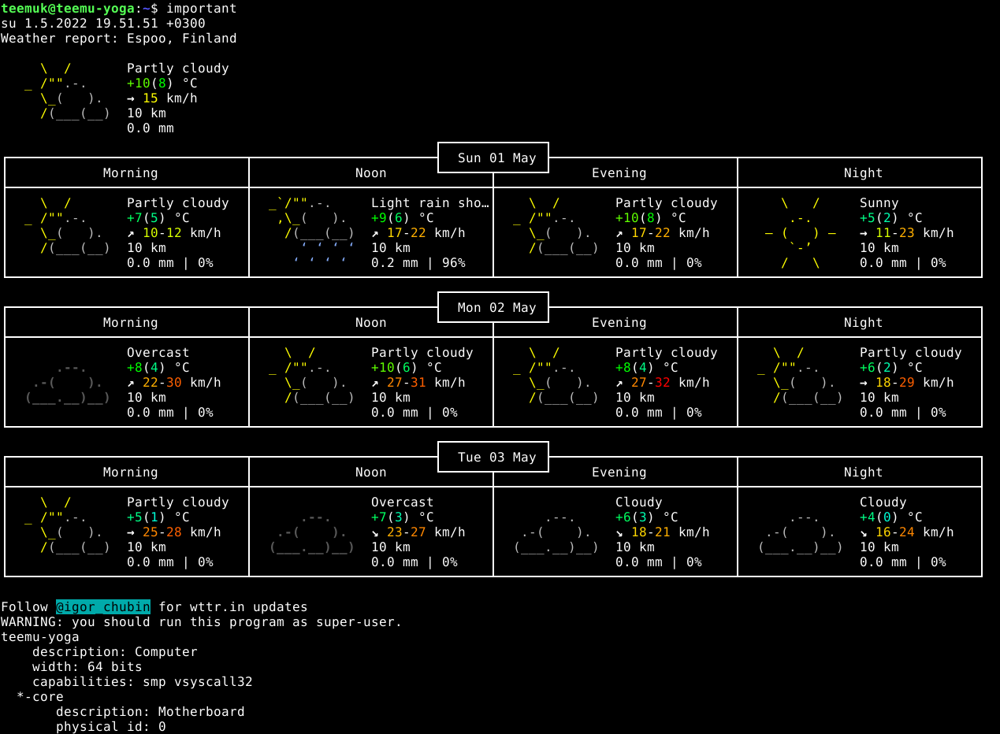

Raspberry:

Näyttää siltä, että unohdin lisätä tuon lshw komennon asennuksen tuonne init.sls tiedostoon, jotenka korjataas tämä asia.

Nyt on lshw komento lisätty tonne. Testataan uudelleen. 

	$ sudo salt "*" state.apply important
	teemu-yoga:
	----------
	          ID: lshw
	    Function: pkg.installed
	      Result: True
	     Comment: All specified packages are already installed
	     Started: 20:02:14.360598
	    Duration: 96.404 ms
	     Changes:   
	----------
	          ID: /usr/local/bin/important
	    Function: file.managed
	      Result: True
	     Comment: File /usr/local/bin/important is in the correct state
	     Started: 20:02:14.459724
	    Duration: 16.796 ms
	     Changes:   
	
	Summary for teemu-yoga
	------------
	Succeeded: 2
	Failed:    0
	------------
	Total states run:     2
	Total run time: 113.200 ms
	raspberrypi:
	----------
	          ID: lshw
	    Function: pkg.installed
	      Result: True
	     Comment: The following packages were installed/updated: lshw
	     Started: 20:01:36.203058
	    Duration: 33561.943 ms
	     Changes:   
	              ----------
	              lshw:
	                  ----------
	                  new:
	                      02.18.85-0.1
	                  old:
	----------
	          ID: /usr/local/bin/important
	    Function: file.managed
	      Result: True
	     Comment: File /usr/local/bin/important is in the correct state
	     Started: 20:02:09.774421
	    Duration: 232.016 ms
	     Changes:   
	
	Summary for raspberrypi
	------------
	Succeeded: 2 (changed=1)
	Failed:    0
	------------
	Total states run:     2
	Total run time:  33.794 s

Nyt important Salt komento asensi ton lshw:n Rasbille. Testataan Rasbilla uudelleen.

Nyt vaikuttaa lshw komentokin toimivan Rasbilla eli kotitehtävä suoritettu.	
	
## c) hello.py. Tee järjestelmään uusi komento Pythonilla ja asenna se orjille. Vinkkejä: Hei maailma riittää, mutta propellihatut saavat toki koodaillakin. Shebang on "#!/usr/bin/python3". Helpoin Python-komento on: print("Hei Tero!")

Tehdääs siis ensin käsin tässä esitelty Python komento. 

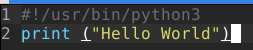

Tein tässä siis tälläisen hello.py ohjelman. Testataan tätä seuraavaksi.

	$ python3 hello.py
	Hello World
	
Python ohjelma vaikuttaa toimivan tehdään tästä Salt komento.

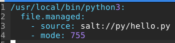

Tein tälläisen Salt komennon, testataan sitä.

	$ sudo salt "*" state.apply py
	teemu-yoga:
	----------
	          ID: /usr/local/bin/python3
	    Function: file.managed
	      Result: True
	     Comment: File /usr/local/bin/python3 updated
	     Started: 20:40:24.673297
	    Duration: 26.453 ms
	     Changes:   
	              ----------
	              diff:
	                  New file
	              mode:
	                  0755
	
	Summary for teemu-yoga
	------------
	Succeeded: 1 (changed=1)
	Failed:    0
	------------
	Total states run:     1
	Total run time:  26.453 ms
	raspberrypi:
	----------
	          ID: /usr/local/bin/python3
	    Function: file.managed
	      Result: True
	     Comment: File /usr/local/bin/python3 updated
	     Started: 20:39:33.059157
	    Duration: 145.392 ms
	     Changes:   
	              ----------
	              diff:
	                  New file
	              mode:
	                  0755
	
	Summary for raspberrypi
	------------
	Succeeded: 1 (changed=1)
	Failed:    0
	------------
	Total states run:     1
	Total run time: 145.392 ms
	
Vaikutti onnistuvan testataan vielä itse Python komentoa.

	$ hello.py
	bash: hello.py: command not found
	~$ cd /usr/local/bin/python3
	bash: cd: /usr/local/bin/python3: Not a directory
	$ cd /usr/local/bin/
	/usr/local/bin$ ls
	fd  hello  important  python3
	/usr/local/bin$ cd
	$ python3
	Hello World
	
Python komento vaikuttaa toimivan, testataan vielä Rasbilla.

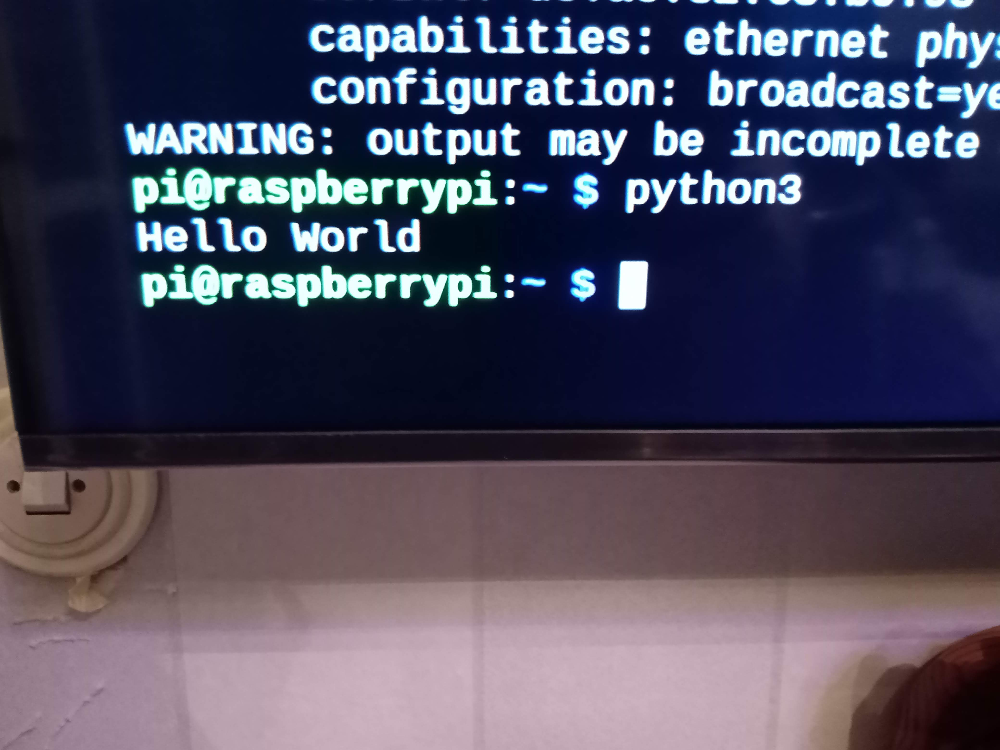

Python komento toimii kans Rasbilla jotenka C kohta on done.

## d) Laiskaa skriptailua. Tee kansio, josta jokainen skripti kopioituu orjille. Vinkki: 'salt-call --local sys.state_doc file.recurse'. Kun tämä on valmis, on todella helppoa laittaa orjille mikä tahansa yhden tiedoston shell script, Python-ohjelma, Perl-ohjelma, Go-binääri tai muu yhden binäärin ohjelma.

Tehdääs siis uusi Salt kansio ja sinne init.sls tiedosto.

	$ cd /srv/salt
	/srv/salt$ sudo mkdir all

Seuraavaksi kopioidaan hellon init.sls, jonka jälkeen kopioidaan kaikki aiemmin tehdyt scriptit komennot all kansioon.

	/srv/salt/all$ ls
	hello  hello.py  important  init.sls

Korjataan seuraavaksi tuo init.sls tiedosto.

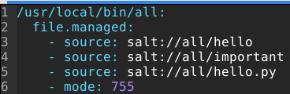

Testataan seuraavaksi tätä, komentoa mutta käyn sitä ennen poistamassa kyseiset komennot Rasbilta niin nähfään jotain tuloksia.

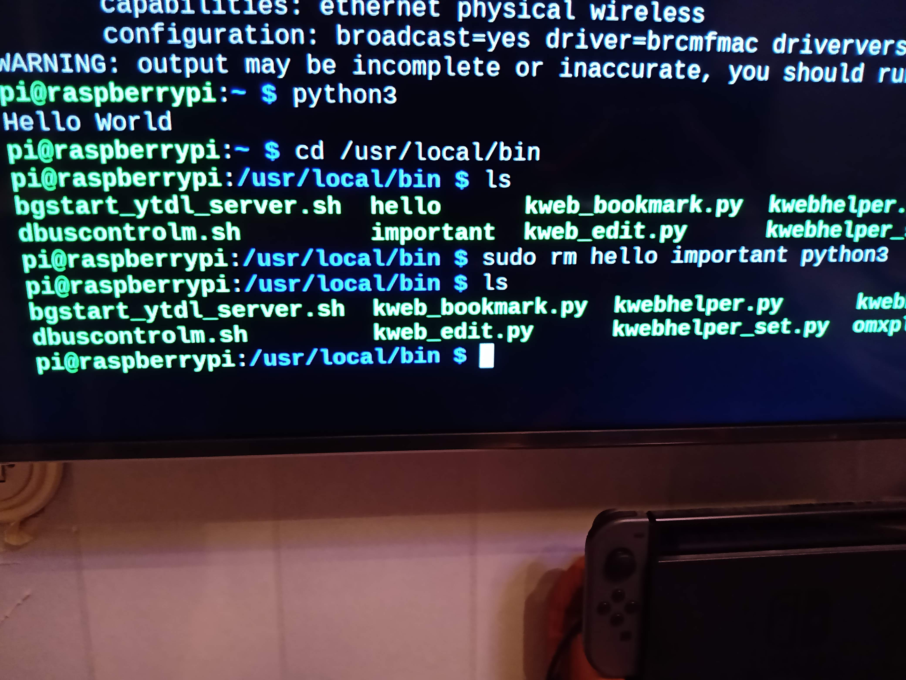

Nyt on taikurin taskut tyhjät ainakin Rasbilta. Nyt voidaan testata tätä all komentoa.

	$ sudo salt "*" state.apply all 
	teemu-yoga:
	----------
	          ID: /usr/local/bin/all
	    Function: file.managed
	      Result: True
	     Comment: File /usr/local/bin/all updated
	     Started: 22:03:46.078331
	    Duration: 65.351 ms
	     Changes:   
	              ----------
	              diff:
	                  New file
	              mode:
	                  0755
	
	Summary for teemu-yoga
	------------
	Succeeded: 1 (changed=1)
	Failed:    0
	------------
	Total states run:     1
	Total run time:  65.351 ms
	raspberrypi:
	----------
	          ID: /usr/local/bin/all
	    Function: file.managed
	      Result: True
	     Comment: File /usr/local/bin/all updated
	     Started: 22:02:54.745579
	    Duration: 186.878 ms
	     Changes:   
	              ----------
	              diff:
	                  New file
	              mode:
	                  0755
	
	Summary for raspberrypi
	------------
	Succeeded: 1 (changed=1)
	Failed:    0
	------------
	Total states run:     1
	Total run time: 186.878 ms
	
	$ all
	Hello World
	
Erikoista vaikuttaa siltä, että tämä komento ajoi  vain tuon aiemmin luodun Python ohjelman. Korjataas inut.sls tiedosto.

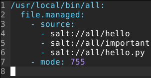

Testataan tätä uutta versiota.

	$ sudo salt "*" state.apply all
	teemu-yoga:
	----------
	          ID: /usr/local/bin/all
	    Function: file.managed
	      Result: True
	     Comment: File /usr/local/bin/all updated
	     Started: 22:11:58.684083
	    Duration: 73.714 ms
	     Changes:   
	              ----------
	              diff:
	                  --- 
	                  +++ 
	                  @@ -1,2 +1,2 @@
	                  -#!/usr/bin/python3
	                  -print ("Hello World")
	                  +#!/bin/bash
	                  +echo "hello world"
	
	Summary for teemu-yoga
	------------
	Succeeded: 1 (changed=1)
	Failed:    0
	------------
	Total states run:     1
	Total run time:  73.714 ms
	raspberrypi:
	----------
	          ID: /usr/local/bin/all
	    Function: file.managed
	      Result: True
	     Comment: File /usr/local/bin/all updated
	     Started: 22:11:08.115181
	    Duration: 343.843 ms
	     Changes:   
	              ----------
	              diff:
	                  --- 
	                  +++ 
	                  @@ -1,2 +1,2 @@
	                  -#!/usr/bin/python3
	                  -print ("Hello World")
	                  +#!/bin/bash
	                  +echo "hello world"
	
	Summary for raspberrypi
	------------
	Succeeded: 1 (changed=1)
	Failed:    0
	------------
	Total states run:     1
	Total run time: 343.843 ms

	$ all
	hello world

Nyt se teki jotain muutoksia tonne all komentoon, mutta tällä kertaa se ajoi vain tuon ensimmäisen shelliskriptin. Korjataas uudelleen.

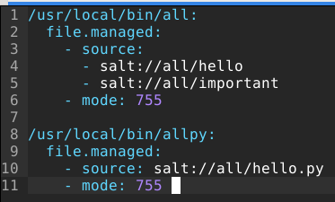

Kokeillaas tätä sitten.

	$ sudo salt "*" state.apply all
		teemu-yoga:
		----------
		          ID: /usr/local/bin/all
		    Function: file.managed
		      Result: True
		     Comment: File /usr/local/bin/all is in the correct state
		     Started: 22:19:01.003896
		    Duration: 63.775 ms
		     Changes:   
		----------
		          ID: /usr/local/bin/allpy
		    Function: file.managed
		      Result: True
		     Comment: File /usr/local/bin/allpy updated
		     Started: 22:19:01.067835
		    Duration: 17.754 ms
		     Changes:   
		              ----------
		              diff:
		                  New file
		              mode:
		                  0755
		
		Summary for teemu-yoga
		------------
		Succeeded: 2 (changed=1)
		Failed:    0
		------------
		Total states run:     2
		Total run time:  81.529 ms
		raspberrypi:
		----------
		          ID: /usr/local/bin/all
		    Function: file.managed
		      Result: True
		     Comment: File /usr/local/bin/all is in the correct state
		     Started: 22:18:09.413896
		    Duration: 200.978 ms
		     Changes:   
		----------
		          ID: /usr/local/bin/allpy
		    Function: file.managed
		      Result: True
		     Comment: File /usr/local/bin/allpy updated
		     Started: 22:18:09.615851
		    Duration: 65.119 ms
		     Changes:   
		              ----------
		              diff:
		                  New file
		              mode:
		                  0755
		
		Summary for raspberrypi
		------------
		Succeeded: 2 (changed=1)
		Failed:    0
		------------
		Total states run:     2
		Total run time: 266.097 ms

		$ all
		hello world
		$ allpy
		Hello World

Kaivelin netistä vähän tietoa ja vaikuttaa siltä, että sellaista yhden komennon ihmettä ei voi luoda Saltilla joka yhdistäisi kaikki sourcet yhdeksi isoksi komennoksi, jota voisi sitten ajaa. Muutetaas sitä init.sls tiedostoa vastaamaan tätä asiaa, että sellaista komentoa ei voi tehdä.

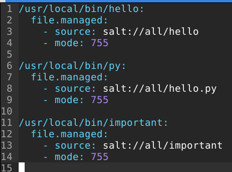

Testataas tätä ja tällä kertaa varmaan onnsituu kaikki.

	 sudo salt "*" state.apply all
	teemu-yoga:
	----------
          ID: /usr/local/bin/hello
    Function: file.managed
      Result: True
     Comment: File /usr/local/bin/hello is in the correct state
     Started: 22:33:28.909193
    Duration: 47.83 ms
     Changes:   
	----------
          ID: /usr/local/bin/py
    Function: file.managed
      Result: True
     Comment: File /usr/local/bin/py updated
     Started: 22:33:28.957164
    Duration: 9.432 ms
     Changes:   
              ----------
              diff:
                  New file
              mode:
                  0755
	----------
          ID: /usr/local/bin/important
    Function: file.managed
      Result: True
     Comment: File /usr/local/bin/important is in the correct state
     Started: 22:33:28.966721
    Duration: 14.129 ms
     Changes:   

	Summary for teemu-yoga
	------------
	Succeeded: 3 (changed=1)
	Failed:    0
	------------
	Total states run:     3
	Total run time:  71.391 ms
	raspberrypi:
	----------
          ID: /usr/local/bin/hello
    Function: file.managed
      Result: True
     Comment: File /usr/local/bin/hello updated
     Started: 22:32:37.441213
    Duration: 125.145 ms
     Changes:   
              ----------
              diff:
                  New file
              mode:
                  0755
	----------
          ID: /usr/local/bin/py
    Function: file.managed
      Result: True
     Comment: File /usr/local/bin/py updated
     Started: 22:32:37.567305
    Duration: 61.416 ms
     Changes:   
              ----------
              diff:
                  New file
              mode:
                  0755
	----------
          ID: /usr/local/bin/important
    Function: file.managed
      Result: True
     Comment: File /usr/local/bin/important updated
     Started: 22:32:37.629653
    Duration: 86.482 ms
     Changes:   
              ----------
              diff:
                  New file
              mode:
                  0755

	Summary for raspberrypi
	------------
	Succeeded: 3 (changed=3)
	Failed:    0
	------------
	Total states run:     3
	Total run time: 273.043 ms

Testataan vielä komentoja.

	$ hello
	hello world
	teemuk@teemu-yoga:~$ py
	Hello World
	$ important
	su 1.5.2022 22.37.06 +0300
	Weather report: Espoo, Finland

	      \   /     Clear
	       .-.      +5(2) °C       
	    ― (   ) ―   → 9 km/h       
	       `-’      10 km          
	      /   \     0.0 mm         

Komennot vaikuttavat toimivan. Testataan Rasbilla.

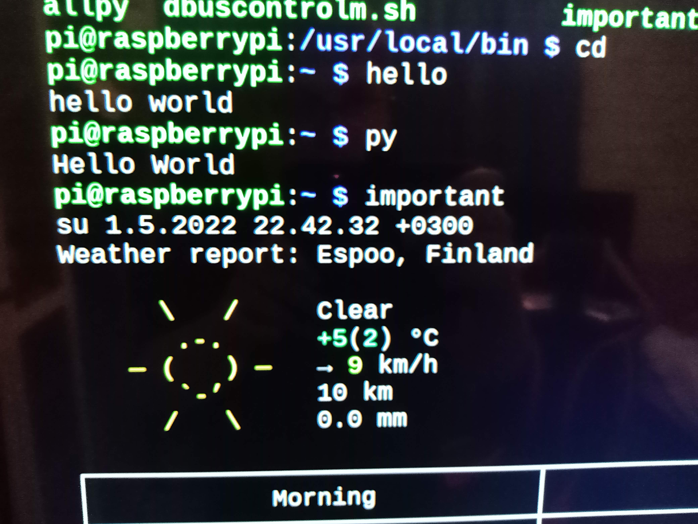

Komennot toimivat myös Rasbilla. Tehtävä D on done. Tajusin muuten vasta nyt aamulla 2.5.2022, että tää tehtävä ois varmaan pitäny suorittaa käyttäen top.sls tiedostoa, jotenka luodaan sellainen ja testataan. Ohjeita tämän tekemiseen löysin [Saltin](https://docs.saltproject.io/en/getstarted/fundamentals/top.html) omilta sivuilta.

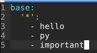

Tein tälläisen top.sls tiedoston kokeillaas sitä ja kävin ennen tämän tiedoston tekoa poistamassa siinä olevat komennot Rasbilta, jotta saadaan tuloksia.

	$ sudo salt "*" state.apply 
	teemu-yoga:
	----------
	          ID: /usr/local/bin/hello
	    Function: file.managed
	      Result: True
	     Comment: File /usr/local/bin/hello is in the correct state
	     Started: 09:38:40.219371
	    Duration: 25.764 ms
	     Changes:   
	----------
	          ID: /usr/local/bin/python3
	    Function: file.managed
	      Result: True
	     Comment: File /usr/local/bin/python3 is in the correct state
	     Started: 09:38:40.245276
	    Duration: 9.068 ms
	     Changes:   
	----------
	          ID: lshw
	    Function: pkg.installed
	      Result: True
	     Comment: All specified packages are already installed
	     Started: 09:38:41.560243
	    Duration: 71.957 ms
	     Changes:   
	----------
	          ID: /usr/local/bin/important
	    Function: file.managed
	      Result: True
	     Comment: File /usr/local/bin/important is in the correct state
	     Started: 09:38:41.632474
	    Duration: 13.688 ms
	     Changes:   
	
	Summary for teemu-yoga
	------------
	Succeeded: 4
	Failed:    0
	------------
	Total states run:     4
	Total run time: 120.477 ms
	raspberrypi:
	----------
	          ID: /usr/local/bin/hello
	    Function: file.managed
	      Result: True
	     Comment: File /usr/local/bin/hello updated
	     Started: 09:37:49.099090
	    Duration: 113.965 ms
	     Changes:   
	              ----------
	              diff:
	                  New file
	              mode:
	                  0755
	----------
	          ID: /usr/local/bin/python3
	    Function: file.managed
	      Result: True
	     Comment: File /usr/local/bin/python3 updated
	     Started: 09:37:49.213511
	    Duration: 36.918 ms
	     Changes:   
	              ----------
	              diff:
	                  New file
	              mode:
	                  0755
	----------
	          ID: lshw
	    Function: pkg.installed
	      Result: True
	     Comment: All specified packages are already installed
	     Started: 09:37:56.792689
	    Duration: 286.591 ms
	     Changes:   
	----------
	          ID: /usr/local/bin/important
	    Function: file.managed
	      Result: True
	     Comment: File /usr/local/bin/important updated
	     Started: 09:37:57.079985
	    Duration: 101.529 ms
	     Changes:   
	              ----------
	              diff:
	                  New file
	              mode:
	                  0755
	
	Summary for raspberrypi
	------------
	Succeeded: 4 (changed=3)
	Failed:    0
	------------
	Total states run:     4
	Total run time: 539.003 ms
	
Tämä vaikuttaa juurikin siltä mitä tässä tehtävässä oli pyydetty ja minä ääliönä kokeilin muita keinoja eilen. Testataan vielä komennot Rasbilla.

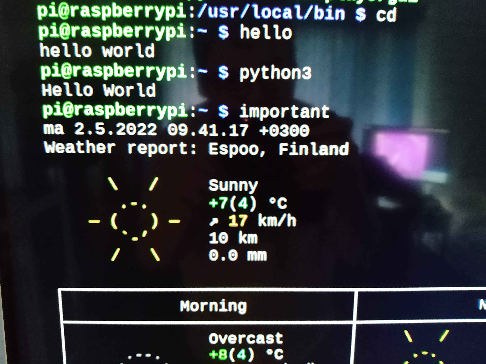

Komennot toimivat Rasbilla, jotenka nyt D kohta on oikeasti done.
			
## e) Intel. Etsi kolme loppuprojektia joltain vanhalta kurssitoteutukselta. Kuvaile projektit tiiviisti ja linkitä alkuperäiseeen raporttin. Vinkkejä: Loppuprojekteja löydät etsimällä opiskelijoiden raportteja vanhoilta kursseilta ja selailemalla sivuja, joilta ne löytyivät. Raportteja löytyy vanhojen kurssitotetusten kommenteista. Ja tietysti kannattaa silmäillä listaa sieltä täältä, niin näet eri projektit kuin muut. Voi hakea myös Googlella ja DuckDuckGolla.

Ruvetaas sitten etsimään näitä loppuprojekteja.

### Salt My Ubuntu by Joonas Kulmala

Tämä oli siis kevään 2021 palvelinten hallinnan loppuprojekti ja se käsittelee sitä, miten Salt-Minionin saa asennettua yhdellä komennolla sekä lisättyä tarvittavat repositoryt, jotta Saltin saa toimimaan. Joonas oli myös laittanut manuaalisen asennuksen ohjeet mukaan jos hänen tekemä install-minion komento ei toimisi. [Linkki](https://github.com/JoonasKulmala/Palvelinten-Hallinta/tree/main/h7) projektiin. 

### Nqinx Virtual Host by Markus Saikkonen

## e) Lukua, ei luottamusta. Kokeile yhtä kohdassa d-Intel löytämääsi modulia koneella. Tämä on infraa koodina, joten luottamusta ei tarvita. Voit lukea koodista, mitä olet ajamassa.
