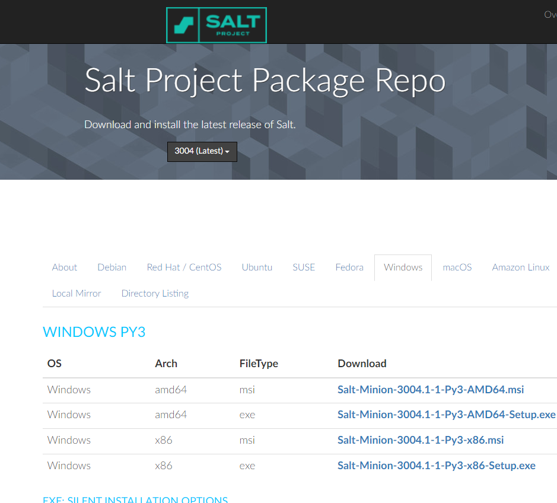
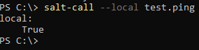
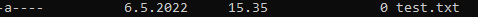
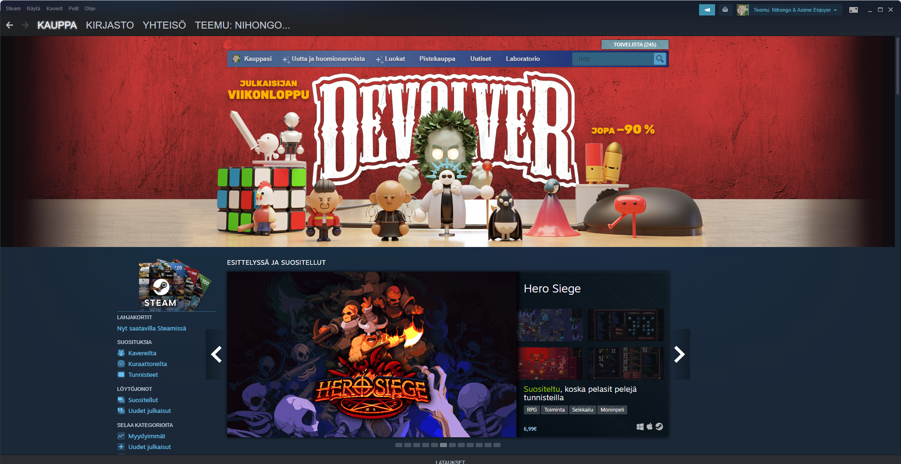
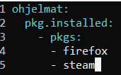
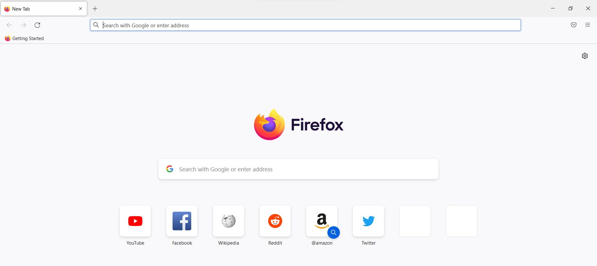
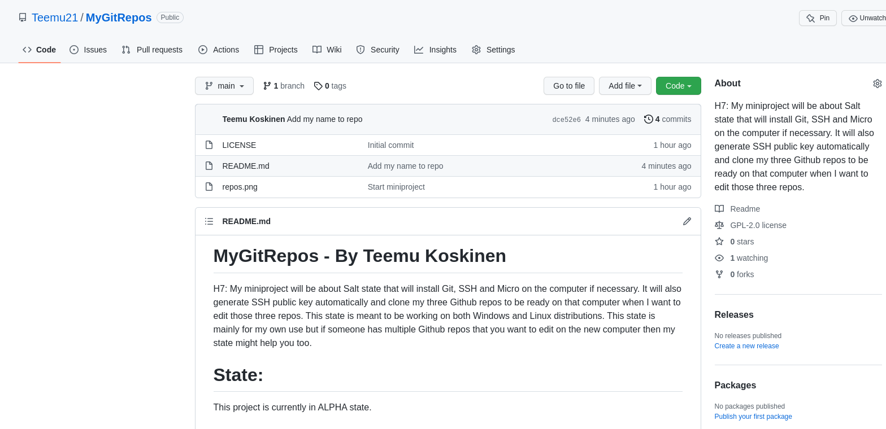

# H6 - Akkuna

## By Teemu Koskinen

## Windows koneen rauta:

OS: Windows 11

CPU: 11th Gen i5-11300H @ 3.10GHz

GPU: RTX 3060 Laptop

RAM: 16 GT

Muut Linux tehtävät on tehty oikealla Linux läppärillä, jonka raudalla on oma sivu täällä Linux-HomeWork repossa ja sillä tullaan myös tekemään suurimmaksi osaksi tuo oma miniprojketi. 

## v) Lue ja tiivistä artikkeli muutamalla ranskalaisella viivalla. Tässä z-alakohdassa ei tarvitse siis tehdä testejä tietokoneella.

Karvinen 2018: Control Windows with Salt

- Karvinen käy artikkelin alussa ensin yleisiä asioita LInuxista ja Windowsista.
- Tämän jälkeen käydään läpi Saltin herra version päivitys, sillä herralla on aina oltava sama tai uudempi versio Saltista kuin orjalla. Orjalla eli tässä tapauksessa Windowsilla uudempi versio Saltissa on yleensä selkeästi parempi vaihtoehto kuin vanha Saltin versio koska uusissa Saltin versioissa on parempi Windows tuki.
- Seuraavaksi käsitellään Salt orjan asennus Windowsille, johon löytyy ohjeet ja versiot docs.saltproject.iosta. Samalla käsitellään myös Windows koneen hyväksyminen orjaksi, joka toimii samalla tavalla kuin muidenkin orjien kanssa eli salt-key komennon avulla.
- Tämän jälkeen käydään läpi Windows repojen lisäämistä Salttiin herralla.
- Tämän jälkeen käsittellään pakettien asennusta Windowsilla ja nse toimii pääsääntöiesti samalla tavalla kuin Linuxilla.
- Sitten käydään kerrotaan siit, että Windowsilla on käytössä PowerShell Bashin sijaan.
- Tämän jälkeen käydään läpi miten Salttia voi ajaa paikallisesti Windowsilla ja testata sitä esim. test.ping komennolla.
- Sitten kerrotaan siit, että Windowsilla voi käyttää muitakin paketinhallinta ohjelmia kuin Saltin omaa ja yksi näistä on Chocolatey, jossa on yli 9000 ohjelmaa saatavana.
- Tämän jälkeen esitellään miltä infra koodina näyttää Windowsilla.
- Sitten puhutaan rooleista, mutta artikkelikin sanoo, että niistä tarvitse välittää koska ne eivät oimi useimmilla Windowseilla.
- Lopussa on sitten yhteenveto, jossa ehdotetaan Salt tilojen tekemisestä Windowsille tai siirtymisestä lopullisesti Linuxiin.

## a) Suolaikkuna. Asenna Salt Windowsiin. Jos ehdit jo asentaa, voit kirjoittaa muistinvaraisesti, mutta muista silloin merkitä, että tämä on muistista kirjoitettu. Näytä testillä (test.ping, file.managed tms), että Salt toimii.

Tämä kohta on tehty musitinvaraisena! Eilen 5.5.2022 tunnilla piti asentaa Saltti Windowsille ja meille annettiin tuo Karvisen Control Windows with Salt artikkeli ohjeeksi. Windowssiksi valitsin nykyisen pelikoneeni, koska käytän sitä periaattessa päivittäin pelaamisen lisäksi myös kouluhommiin. Saltin latasin Windowssille [täältä](https://repo.saltproject.io/#windows). 

Valitsin tosta kuvasta ton Salt-Minion-3004.1-1-Py3-AMD64-Setup.exe tiedoston ja ajoin sen tällä koneella. Kun asennustiedosto kysyi orjan ID:tä niin annoin sille ID:ksi windows ja annoin sille herran osoitteeksi Linux koneeni osoitteen, joka on aiemmin toiminut ainakin Raspberry Pi orjan kanssa. Minulla oli tunnilla SSH yhteys auki herra koneeseen (Koska se oli eri huoneessa, enkä jaksanut liikkua kahden koneen välillä edestakaisin.), jossa ajoin sitten sudo salt 'windows' test.ping komennon ja vastaukseksi tuli true eli Saltti selkeästi toimi nyt mun Windows koneella. Tehdään seuraavaksi local testi Saltista ajamalla tuo aiemmin mainittu test.ping komento.

 

Kuten yllä olevasta kuvasta näkyy niin Saltti toimii tänäänkin koska test.ping lähettää vastauksen true.

## b) Single. Näytä komentorivillä Saltilla (state.single) esimerkit funktioista file ja cmd.

Tehdääs näistä kahdesta funktiosta esimerkit.

file:

	salt-call --local state.single file.managed C:/test.txt
	[WARNING ] State for file: C:/test.txt - Neither 'source' nor 'contents' nor 'contents_pillar' nor 'contents_grains' was defined, yet 'replace' was set to 'True'. As there is no source to replace the file with, 'replace' has been set	 to 'False' to avoid reading the file unnecessarily.
	local:
	----------
	          ID: C:/test.txt
	    Function: file.managed
	      Result: True
	     Comment: Empty file
	     Started: 15:35:35.170554
	    Duration: 34.585 ms
	     Changes:
	              ----------
	              new:
	                  file C:/test.txt created
	
	Summary for local
	------------
	Succeeded: 1 (changed=1)
	Failed:    0
	------------
	Total states run:     1
	Total run time:  34.585 ms

File.managed toiminto vaikuttaa toimivan.

cmd:

	PS C:\> salt-call --local state.single cmd.run steam.exe
	[ERROR   ] Command 'steam.exe' failed with return code: 1
	[ERROR   ] stderr: 'steam.exe' is not recognized as an internal or external command,
	operable program or batch file.
	[ERROR   ] retcode: 1
	[ERROR   ] {'pid': 12868, 'retcode': 1, 'stdout': '', 'stderr': "'steam.exe' is not recognized as an internal or external command,\r\noperable program or batch file."}
	local:
	----------
	          ID: steam.exe
	    Function: cmd.run
	      Result: False
	     Comment: Command "steam.exe" run
	     Started: 15:54:46.957997
	    Duration: 19.0 ms
	     Changes:
	              ----------
	              pid:
	                  12868
	              retcode:
	                  1
	              stderr:
	                  'steam.exe' is not recognized as an internal or external command,
	                  operable program or batch file.
	              stdout:
	
	Summary for local
	------------
	Succeeded: 0 (changed=1)
	Failed:    1
	------------
	Total states run:     1
	Total run time:  19.000 ms

Kokeilin ajaa Steamiä sillä sehän on asennettuna tällä koneella, mutta näemmä mun pitää olla tarkempi siinä mistä tää cmd.run etsii tuota steam.exeä.

	PS C:\> salt-call --local state.single cmd.run "C:\Program Files (x86)\Steam\steam.exe"
	local:
	----------
	          ID: C:\Program Files (x86)\Steam\steam.exe
	    Function: cmd.run
	      Result: True
	     Comment: Command "C:\Program Files (x86)\Steam\steam.exe" run
	     Started: 16:11:18.790186
	    Duration: 145.133 ms
	     Changes:
	              ----------
	              pid:
	                  19172
	              retcode:
	                  0
	              stderr:
	              stdout:
	
	Summary for local
	------------
	Succeeded: 1 (changed=1)
	Failed:    0
	------------
	Total states run:     1
	Total run time: 145.133 ms

Piti testata pari kertaa ennen ku hoksasin, että lainausmerkit pitää laittaa Windows polun alkuun ja loppuun, jotta komento toimisi.

Tässä on vielä tulos:

Steamin aloitussivu avautui ja siellä on näemmä ny viikonlopun ajan -90% tarjouksia.

## c) IaCcuna. Tee Windowsissa infraa koodina, ja aja se paikallisesti (salt-call --local state.apply foo)

Jatketaas sitten näitä Linux tehtäviä 7.5 ja tehdään infraa koodina Windowsilla. Tutkin eilen vähän tätä Salttia Windowsilla ja löysin paikan mihin Saltin kansiot kuuluu Windowsilla luoda ja niiden oletus paikka on PS C:\Program Files\Salt Project\Salt>. Tehdään seuraavaksi siis Saltin tila, joka asentaa Firefoxin ja Steamin tälle koneelle.

	PS C:\Program Files\Salt Project\Salt> mkdir ohjelmat
	
	
	    Directory: C:\Program Files\Salt Project\Salt
	
	
	Mode                 LastWriteTime         Length Name
	----                 -------------         ------ ----
	d-----          7.5.2022      8.07                ohjelmat

Init.sls tiedosto:

Testataan tätä seuraavaksi.

	PS C:\Program Files\Salt Project\Salt\ohjelmat> cd C:/
	PS C:\> salt-call --local state.apply ohjelmat
	local:
	    Data failed to compile:
	----------
	    No matching sls found for 'ohjelmat' in env 'base'

Erikoista vaikuttaa siltä, että Saltti ei toimi Windowsissa samalla tavalla kuin Linuxilla sillä äskenhän loin ton ohjelmat kansion sekä sinne init.sls tiedoston ja nyt ei muka löydy.

Kokeillaas ajaa tämä komento Salt kansiossa jos se vaikka auttaisi.

	PS C:\Program Files\Salt Project\Salt> salt-call --local state.apply ohjelmat
	local:
	    Data failed to compile:
	----------
	    No matching sls found for 'ohjelmat' in env 'base'

Hyvin outoa kyllä sen tuolla olisi pitänyt jo toimia. Tutkitaas asiaa sitten netistä. Tutkittuani netistä jonkin aikaa ja löytämättä mitään konkreettisia ohjeita Windowsille niin kävin katsomassa Saltin kansiota ja ajoin salt-minion-debug.bat ohjelman ja kun se oli käynnissä huomasin, että ainakin Saltin konfiguraatio tiedostot löytyvät program data kansiosta ja sen srv/salt kansion alle pitäisi varmaan luoda nuo Saltin tilat Windowsilla. Kokeillaas siis tätä.

	PS C:\> salt-call --local state.apply ohjelmat
	 [ERROR   ] Unable to locate package firefox
	 [ERROR   ] {'firefox': 'Unable to locate package firefox'}
	 local:
	 ----------
	           ID: ohjelmat
	     Function: pkg.installed
	       Result: False
	      Comment: The following packages failed to install/update: firefox
	               The following packages were already installed: steam
	      Started: 08:53:21.065269
	     Duration: 4236.476 ms
	      Changes:
	               ----------
	               firefox:
	                   Unable to locate package firefox
	 
	 Summary for local
	 ------------
	 Succeeded: 0 (changed=1)
	 Failed:    1
	 ------------
	 Total states run:     1
	 Total run time:   4.236 s

No niin, nyt mun Saltin tila ainakin toimii vaikkakin Firefoxia se ei pystynyt jostain syystä asentamaan. 

Katsoin seuraavaksi tuota repo-ng kansiota ja huomasin, että Firefox ei asentunut siksi, että siihen olisi pitänyt tarkentaa mikä Firefoxin versio asennetaan eli korjataas init.sls tiedosto ja kokeillaan uudelleen.

Korjattu Saltin tila:

	ohjelmat:
	  pkg.installed:
	    - pkgs:
	      - firefox_x64
	      - steam
	
Kokeillaan uudelleen.

	PS C:\> salt-call --local state.apply ohjelmat
	local:
	----------
	          ID: ohjelmat
	    Function: pkg.installed
	      Result: True
	     Comment: The following packages were installed/updated: firefox_x64
	              The following packages were already installed: steam
	     Started: 09:02:03.585106
	    Duration: 49970.42 ms
	     Changes:
	              ----------
	              Mozilla Maintenance Service:
	                  ----------
	                  new:
	                      98.0.1
	                  old:
	              firefox_x64:
	                  ----------
	                  new:
	                      98.0.1
	                  old:
	
	Summary for local
	------------
	Succeeded: 1 (changed=1)
	Failed:    0
	------------
	Total states run:     1
	Total run time:  49.970 s

Nyt vaikuttaa Firefox asentuneen. Testataan vielä sitä.

Jee, Firefox toimii. 
	
## e) Goal. Tee projektisi palautussivu. Voit tehdä sen GitHubiin, kotisivullesi tai mihin vain haluat. Mistä teet miniprojektin? Kuvaile miniprojektin tarkoitus lauseella tai parilla. Asenna käsin (jokin alustava osa) projektistasi ja ota ruutukaappaus siitä, miten lopputulosta käytetään. Tietysti pääset tekemään paremman ruutukaappauksen, kun projektisi on valmis. Valitse projektille lisenssi (suosittelen GPL 2, voit valita lisenssin vapaasti). Laita sivulle nimesi (tai jos haluat, nimimerkki, mutta suosittelen nimeä). Ja lähdekoodiksi vaikkapa vain Saltin hei maailma. Kirjoita ohje, miten projektisi otetaan käyttöön. Kirjoita projektin kypsyys näkyviin, tässä vaiheessa se on varmaankin alpha, eli vastaaloitettu eikä vielä voi varsinaisesti edes kunnolla testata. Yritä tehdä sivu, jossa tärkeimmät asiat näkyvät taitoksen yllä (skrollaamatta): tarkoitus, ruutukaapaus, lisenssi, nimesi, latauslinkki, kypsyysaste (alpha). Tässä vaiheessa projektin ei vielä tarvitse toimia, vaan kaikkiin osiin tehdään vielä parannuksia. Voit kirjoittaa englanniksi tai suomeksi, suosittelen englantia.

[Linkki](https://github.com/Teemu21/MyGitRepos) mun miniprojektiin ja tässä vielä kuva miniprojektin etusivusta:

Jos alphaa haluaa testata niin voi kopsata tämän koodinpätkän: 

	git clone git@github.com:Teemu21/Animesongs.git && git clone git@github.com:Teemu21/Soturikissat.git && git clone git@github.com:Teemu21/MyGunpla.git

## f & g) 

Tehty.

## Lähteet:

Karvinen 2018: [Control Windows with Salt](https://terokarvinen.com/2018/control-windows-with-salt/)

Saltin lataus Windowsille: [Windows Salt](https://repo.saltproject.io/#windows)
