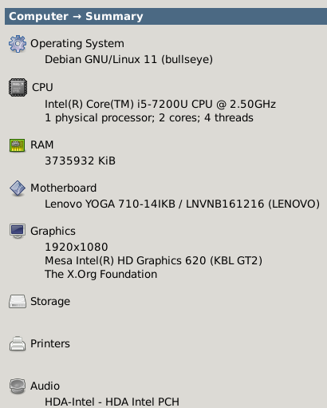

# Koneen Laitteisto

Pääsääntöisesti tällä koneella on tehty kaikki Palvelinten hallinnan Linux tehtävät. Jos jokin tehtävä on tehty toisella koneella niin siitä on sitten erikseen mainittu.

# Speksit:

